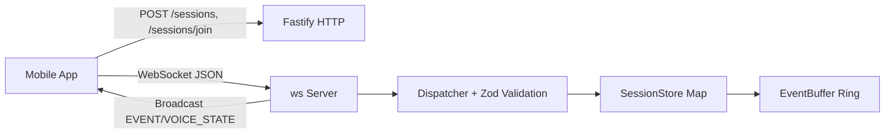

# Waypoints — Project Deep-Dive (Filled Study Guide)

Use this as your interview script. Practice saying each section out loud until you can explain it without reading.

---

## 1. Project Overview

Waypoints is a real-time social location-sharing app where friends create temporary sessions, join by code, and coordinate on a live map with presence, destination markers, chat, and optional voice signaling. The system is built around a custom WebSocket protocol with reconnect-safe synchronization using monotonic event IDs plus replay.

**Problem solved:** Group coordination while moving (meetups, events, road trips) without fragmented text threads.

**Users:** Small groups of friends (MVP target up to ~20 concurrent participants in a session).

**Why it exists:** To ship a production-grade real-time mobile system and demonstrate protocol design, state synchronization, and deployment end-to-end.

---

## 2. Motivation / Problem Statement

Before Waypoints, group coordination was ad hoc: texts like “where are you?” with no shared, live, session-scoped view. Existing tools are either passive (single-user location sharing), always-on (privacy-heavy), or lack robust reconnect behavior.

**Why existing solutions were insufficient:**
- No session-first UX (temporary invite code + shared context).
- No explicit online/stale/offline presence tied to session activity.
- No custom reconnect-safe event replay semantics.
- Missing integrated destination + map + chat in one flow.

---

## 3. Architecture Overview

Waypoints uses a single backend instance and an Expo React Native mobile app.

| Component | Responsibility | Technology |
|---|---|---|
| Mobile app | UI, GPS capture, WS client, local session state | React Native + Expo, Zustand, react-native-maps |
| HTTP API | Session create/join, health, session info | Fastify |
| WebSocket server | Handshake, ordered events, broadcast, validation | ws |
| Session state | Authoritative live state | In-memory Map + ring buffer |
| Shared contract | Types + runtime message validators | TypeScript + Zod (`@waypoints/shared`) |
| Deployment | Containerized single instance | Docker + Fly.io |

### Architecture Diagram (insert/replace as needed)

### Component Interaction

1. Client creates/joins via HTTP.
2. Client opens WS and sends `HELLO` with `lastEventId`.
3. Server responds `WELCOME` → `SNAPSHOT` → optional `EVENTS` replay.
4. Realtime writes (`LOC_UPDATE`, chat, destination, voice signaling) go through dispatcher + validators + in-memory store.
5. Broadcast fan-out sends updates to session participants.

### Deployment Topology

- Single backend process.
- In-memory live state.
- Fly.io VM (`256mb`, shared CPU), HTTPS enforced.
- No Redis, no multi-instance in MVP.

---

## 4. Data Flow

### 4a. Request Lifecycle (Join + Realtime)

1. User enters join code and display name.
2. Client sends `POST /sessions/join`.
3. Server validates join code format + capacity + displayName.
4. Server allocates `participantId` + token and updates session participant map.
5. Client opens WS and sends `HELLO(sessionId, participantId, token, lastEventId)`.
6. Server authenticates and binds connection.
7. Server returns `WELCOME`, then `SNAPSHOT`.
8. If reconnecting, server sends `EVENTS` for missed range.
9. Client starts 1/sec `LOC_UPDATE`; server rate-limits and broadcasts `EVENT` updates.

### 4b. Async / Background Lifecycle (Current + Phase 3)

**Current MVP:**
- Presence sweep timer every 5s marks online/stale/offline.
- Cleanup timer removes empty/expired sessions.

**Phase 3 planned:**
- Meaningful events buffered in memory.
- Flush to DB every 5s or 50 events.
- On flush failure, log + drop batch (live in-memory state remains authoritative).

### 4c. Data Model

| Entity | Key Fields | Relationships |
|---|---|---|
| `SessionState` | `sessionId`, `joinCode`, `hostParticipantId`, `lastEventId`, `createdAt` | Has many participants + one event buffer + destination + voiceMembers |
| `ParticipantState` | `participantId`, `token`, `lastLocation`, `status`, `lastSeenTs`, `connId` | Belongs to one session |
| `SessionEvent` | `eventId`, `kind`, `ts`, `data` | Stored in per-session ring buffer |
| `ConnState` | `connId`, `sessionId`, `participantId` | Maps active socket to participant |

---

## 5. Technologies Used

| Technology | Why chosen | Role | Alternatives considered |
|---|---|---|---|
| Fastify | High perf + TS-friendly + plugin model | HTTP layer | Express, Nest |
| ws | Minimal overhead + full protocol control | WebSocket transport | Socket.IO |
| Zod | Runtime validation + inferred TS types | Validate all inbound WS messages | Joi, AJV |
| Expo RN | Fast mobile delivery + rich ecosystem | Cross-platform client | Native iOS/Android separate apps |
| Zustand | Minimal API + easy external store access | Session state management | Redux Toolkit, MobX |
| react-native-maps | Standard map integration | Live participant map | Custom map stack |
| Docker | Reproducible deploy artifact | Packaging/deploy | Raw VM scripts |
| Fly.io | Free-tier friendly WS hosting | Backend runtime env | Render, Railway |
| TypeScript monorepo | Shared contract safety | End-to-end types | JS-only, duplicated types |
| WebRTC (`react-native-webrtc`) | P2P voice capability | Voice mesh signaling/media | Server-relayed voice |

### Quick Justifications

- **Backend framework:** Fastify for speed and straightforward access to Node server for WS attach.
- **Database:** None on live path for MVP (in-memory); Phase 3 plans Supabase Postgres for persistence.
- **Message queue:** None in MVP; planned lightweight batched flush loop for event persistence.
- **Caching:** In-memory state itself is the cache/source-of-truth for live session data.
- **APIs/services:** Fly.io deployment, Expo ecosystem, planned Supabase auth/persistence.
- **ML libraries:** Not applicable.

---

## 6. Key Engineering Challenges

### Challenge 1 — Reconnect-safe correctness

- **Hard part:** Prevent duplicates/missing events after disconnect.
- **Why difficult:** Clients can reconnect after variable offline windows while session state keeps changing.
- **Solution:** Monotonic per-session `eventId`, ring buffer replay (`lastEventId`), fallback to snapshot when gap is too large.
- **Outcome:** Deterministic client convergence to server state.

### Challenge 2 — Presence semantics

- **Hard part:** Distinguish online vs stale vs offline reliably.
- **Why difficult:** Location updates are noisy and network can drop without clean disconnect.
- **Solution:** Server timestamps + periodic sweep + explicit disconnect handling.
- **Outcome:** Stable presence indicators with configurable thresholds.

### Challenge 3 — Voice signaling without polluting event replay

- **Hard part:** WebRTC signaling is connection-scoped and stale on reconnect.
- **Why difficult:** Replaying SDP/ICE can create incorrect peer state.
- **Solution:** Keep `VOICE_*` ephemeral (not `EVENT`, no `eventId`, no ring buffer replay).
- **Outcome:** Clear boundary between durable session events and ephemeral media signaling.

### Challenge 4 — Throughput protection

- **Hard part:** Prevent a noisy client from flooding updates.
- **Why difficult:** Broadcast amplifies inbound writes to many recipients.
- **Solution:** Per-participant min interval (`~900ms`) on `LOC_UPDATE`.
- **Outcome:** Bounded write pressure on fan-out path.

---

## 7. Performance & Scalability

### Metrics currently tracked/defined

- Location update cadence: 1 update/sec/client.
- Session target: 20 concurrent users.
- Reconnect backoff: 1s → 2s → 4s → 8s cap.
- Event buffer capacity: 1000/session.
- Presence sweep: 5s interval.
- Session TTL cleanup: periodic, default 2h expiry.
- Join capacity guard: default max 50 participants/session.

### Performance improvements used

- Single serialization path for broadcast payloads.
- In-memory state (no DB round-trip on realtime path).
- Silent drop of overly frequent location updates.
- Shared schema validation pre-handler to fail fast.

### Benchmark/load status

- No formal large-scale synthetic load test yet.
- Confidence currently comes from architecture constraints + integration tests + manual multi-device runs.

### Bottlenecks

- Single-instance memory/CPU limits.
- O(N) broadcast fan-out per event.
- State loss on process restart.

### 10x / 100x scaling plan

1. Externalize live state to Redis + pub/sub.
2. Multi-instance WS workers with session affinity.
3. Token-bucket/global rate limiting.
4. Move voice mesh to SFU for >8 voice participants.

---

## 8. Concurrency / Distributed Aspects

- **Concurrency model:** Node event loop (single process) serializes state mutation.
- **Worker/queue system:** None in MVP.
- **Shared-state hazards handled:**
  - Synchronous eventId increments.
  - Connection unbind on leave to prevent double “left” emission.
- **Distributed coordination:** Not yet (single instance by design).

---

## 9. Reliability & Failure Handling

| Failure | Current behavior | Mitigation |
|---|---|---|
| WS disconnect | Client marked disconnected | Auto reconnect with exponential backoff |
| Reconnect gap beyond buffer | Missed events unavailable | Snapshot fallback to restore correctness |
| Invalid client message | Error reply (`BAD_MESSAGE`) | Zod validation on all inbound messages |
| Non-host destination write | Rejected (`FORBIDDEN`) | Host authorization check |
| Session not found | Error (`NOT_IN_SESSION`) | Client invalidates session and exits flow |
| Server restart | In-memory state lost | Rejoin/recreate session (known MVP tradeoff) |

### Retry/error/observability

- **Retry:** WS reconnect loop with capped backoff.
- **Error handling:** Structured `ERROR` payloads with code + message.
- **Observability:** Fastify logging + `/health` with uptime/session count; deployment healthcheck in Docker/Fly.

---

## 10. Security Considerations

- **Authentication (current):** Opaque token from create/join, verified on `HELLO`.
- **Authentication (planned):** Supabase JWT verification (`AUTH_EXPIRED` handling).
- **Authorization:** Host-only destination mutations; session-scoped routing checks.
- **Input validation:** Zod schema validation for every WS message + HTTP payload checks.
- **Data integrity/privacy:** No long-term location storage in MVP; session-scoped sharing only; HTTPS in production.

**Known limitations:**
- Legacy token model is weaker than JWT + expiry.
- No full abuse/risk controls (e.g., advanced anti-spam) yet.

---

## 11. Tradeoffs & Design Decisions

### Decision A — In-memory live state
- **Options:** In-memory vs Redis vs SQL.
- **Chosen:** In-memory.
- **Why:** Lowest latency, simplest MVP ops.
- **Drawback:** State loss on restart and limited horizontal scalability.

### Decision B — Custom WS protocol
- **Options:** Raw WS vs Socket.IO.
- **Chosen:** Raw WS + typed protocol.
- **Why:** Full control over handshake/replay semantics.
- **Drawback:** More custom protocol code to maintain.

### Decision C — Voice events ephemeral
- **Options:** Replayable `EVENT` vs ephemeral `VOICE_*`.
- **Chosen:** Ephemeral.
- **Why:** Signaling payloads are connection-scoped and stale after reconnect.
- **Drawback:** Users must rejoin voice after reconnect.

### Decision D — Single-instance deployment
- **Options:** Single instance vs distributed from day 1.
- **Chosen:** Single instance.
- **Why:** Cost + speed for MVP.
- **Drawback:** Infra SPOF and finite throughput headroom.

---

## 12. My Personal Contributions

- Designed overall architecture and protocol invariants.
- Implemented backend HTTP + WS handlers, session store, presence, ring buffer, and validation pipeline.
- Implemented mobile session flow, map/presence UI integration, WS client reconnect behavior, and location pipeline.
- Implemented shared protocol/types/validators package.
- Added voice signaling support and associated server/client state handling.
- Wrote and maintained backend test suite (58 tests currently documented in project artifacts).
- Built deployment artifacts (Docker + Fly config) and app release scaffolding.

**Team split:** Solo project (no teammate ownership boundaries).

---

## 13. Testing Strategy

### Unit / integration focus
- Backend tests with Vitest.
- Covers handshake, replay, presence transitions, event buffer behavior, chat/leave behavior, destination authorization, and voice signaling paths.

### Manual validation
- Multi-device live session checks for map/presence/chat.
- Network interruption/reconnect behavior validation.
- Permission-denied location behavior sanity checks.

### Not yet fully covered
- Formal load benchmark with large synthetic WS clients.
- Full mobile automated UI test suite.

---

## 14. Metrics & Claims (Study Version)

### Claim 1 — “Implemented reconnect-safe real-time sync”
- **Measured by:** Integration tests around `lastEventId` replay + snapshot fallback.
- **Baseline:** No reconnect mechanism.
- **Improvement:** Deterministic catch-up after disconnect.

### Claim 2 — “Supports 1 location update/sec/client and session fan-out target of 20 users”
- **Measured by:** Config constraints + end-to-end flow validation.
- **Baseline:** No rate limits.
- **Improvement:** Stable bounded ingest with per-participant limiter.

### Claim 3 — “Built robust backend test coverage”
- **Measured by:** 58 backend tests noted in project docs/history.
- **Baseline:** Minimal/no coverage early.
- **Improvement:** Regression safety for protocol and state logic.

### Claim 4 — “Shipped deployable backend artifact”
- **Measured by:** Docker multi-stage build + healthcheck + Fly runtime config.
- **Baseline:** Local-only app.
- **Improvement:** Repeatable cloud deployment path.

---

## 15. Future Improvements

- Complete Phase 3 Supabase integration (JWT auth, profiles, friendships, session history).
- Add robust load testing (k6/custom WS harness) and publish p95/p99 latency.
- Introduce Redis for multi-instance realtime state + pub/sub.
- Move voice from mesh to SFU for large rooms.
- Add stronger abuse controls, auth hardening, and observability dashboards.
- Reduce technical debt around single-instance assumptions and in-memory durability.

---

## 16. Interview Questions I Should Expect

1. Why did you choose in-memory state for realtime data instead of a database?
2. Walk me through your reconnect flow and how you avoid duplicate events.
3. How does your event buffer work, and what happens when it overflows?
4. Why use raw WebSockets instead of Socket.IO?
5. How do you guarantee message validation and schema correctness?
6. Explain how presence transitions between online/stale/offline.
7. What are your biggest bottlenecks today at 10x traffic?
8. How would you migrate to multi-instance safely?
9. Why are voice messages not replayed after reconnect?
10. What race conditions did you consider, and how did you mitigate them?
11. What exactly is host-authorized vs participant-authorized in your protocol?
12. How do you reason about reliability when the server restarts?
13. Which security risks exist in your current auth model?
14. What evidence backs your resume performance claims?
15. If you had two more weeks, what would you build first and why?

---

## Rapid Practice Prompts

- Explain Waypoints in 30 seconds, 2 minutes, and 5 minutes.
- Whiteboard the handshake + replay sequence from memory.
- Defend three tradeoffs and their downsides without hand-waving.
- Explain one production incident you’d expect and your mitigation plan.
- Quantify your claims with how measured + baseline + delta.
